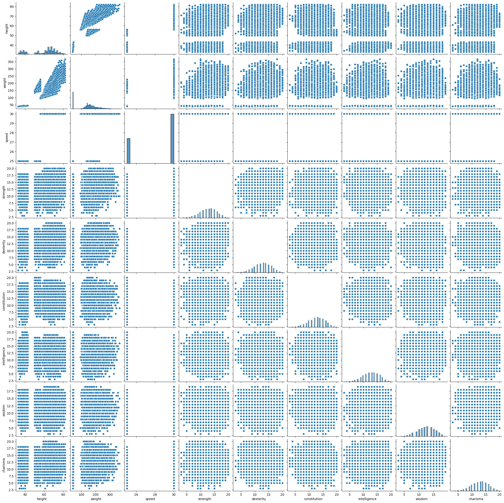
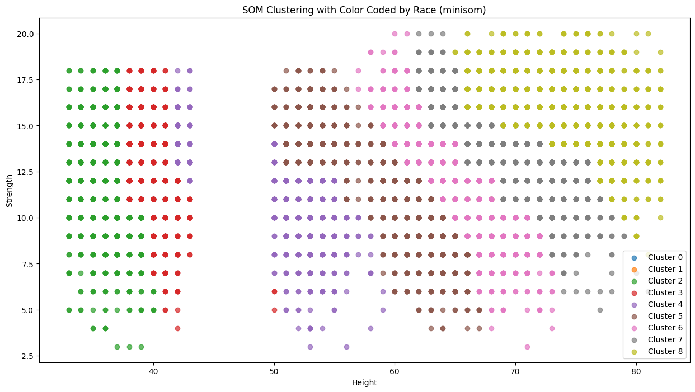
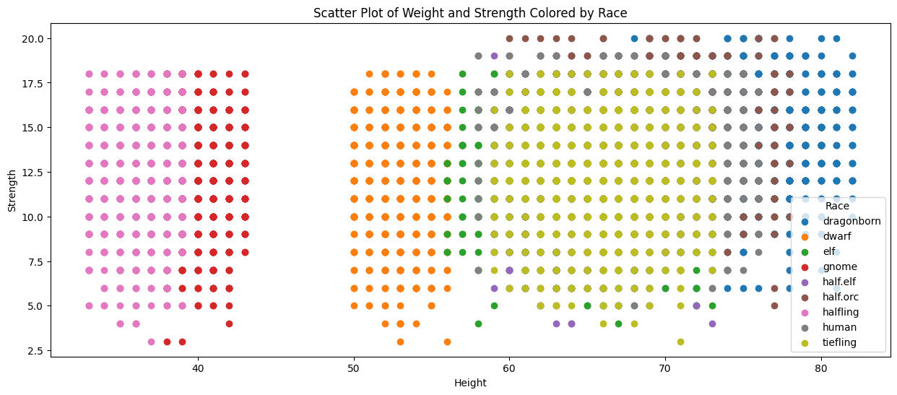

# Dungeon and Dragon Race Clustering with Self-Organizing Map
This is project for G30 Program Vehicle Design final report. Presented by ***Sarun Mukdapitak***.\
In this notebook, I used MiniSom library to implement the DnD (Dungeon and dragon) race clustering.

Credits to Giuseppe Vettigli (Just Glowing) for the MiniSom library which I use here to implement the Self Organizing Map (SOM)\
Repository : https://github.com/JustGlowing/minisom\
Also, Special thanks to JONATHAN KRISTANTO for [minisom's demonstration](https://www.kaggle.com/code/jonathankristanto/customer-clustering-with-self-organizing-map-som).

## Introduction
Dungeon and Dragon is a captivating board game featuring a diverse array of races. Each race within the game is uniquely characterized by distinct statistics.\
The primary objective of this problem is to employ Self-Organizing Maps to cluster these races based on their statistical attributes.\
Another goal of this project is to study how to use and efficiency of SOM Clustering method.

## Short information

Thanks to ANDREW ABELES for generously providing the [dataset](https://www.kaggle.com/datasets/andrewabeles/dnd-stats/data) containing the crucial statistics that define each race within Dungeon and Dragons.

In this dataset, 10,000 datapoints (characters) are collected and features provided in the dataset are as following:
* race ( 9 races including dragonborn, dwarf, elf, gnome, half-elf, half-orc, halfling, human, tiefling)
* height (inches)
* weight (lbs)
* speed (ft.)
* strength
* dexterity
* constitution
* wisdom
* intelligence
* charisma

Note: There are more races in this game, but these are main races.

## Contents
This notebook is divided into 6 parts.
* [Setting up](#content1)
* [Use SOM to cluster race](#content2)
* [Result of actual race based on their statistics](#content3)
* [Discussion](#content4)
* [Conclusion](#content5)
* [Appendix](#content6)

### Setting up 
In this part, the package installation is done in the first code block.\
Also, import the library that is useful in this project.\
Then, download the dataset, separate all the features.\
Finally, plot the data between all pairs of feautres.

As we can see, the plot between height and other stat can detect clustering (other stats pair can't be groupped).
### Use SOM to cluster race 
Thus, in this part, I choose only two stats which is height and strength to be features to cluster the race into 9 clusters.\
The setting hyperparameter is 
* learning_rate = 0.01 -> the smaller learning rate implies finer learning, the bigger means rougher learning.
* sigma = 0.9 -> this is the radius of neighbor node of BMU (Best Matching Unit), the bigger it is means the broader neighbor will be. Small value implies only locally influnce.
* epoch = 100000 -> this is the number of iterations that the node will find BMU through the dataset. epoch = n means it will go through dataset n times. I already set very small learning rate, thus I set this one quite high to compensate the slowness of learning.

Note that since SOM is unsupervised learning, we won't know what each cluster is.

### Result of actual race based on their statistics 
In this part, the stats used in SOM part are used as axes to illustrate the actual race segmentation with the color label using these stats.

## Discussion 
As shown in Figures above (or in notebook), the clustering from SOM method doesn't look like the actual result.\
In this notebook, the other hyperparameter settings and features are not shown, but after several try by myself (you can try by yourself), the result does not looking better.\
That might come from several reasons:
1. The data is not spread enough.\
    As we observe in actual result, some datapoints of one race overlap another race data. Thus, SOM which preserve topological relationships of the input data might not be able to predict accurately.
2. Not enough well-tuned hyperparameters. \
    As we observe that there are some parts that are actually well separated (left and right group). But SOM performance is still not good in dividing those two groups. It might be because not enough well-tuned hyperparameters.
3. Too many target clusters.\
    The more target clusters make it more messier in step of learning, thus, there might be a case that the group is separated (also because of too large sigma).
## Conclusion 
SOM method is not for predicting the exact target type by using just two or few features (or even several features at once). But it can visualize the clustering in more than two parameters (but the more parameters, the harder it will be) as shown in Appendix.\
In my opinion, better method is to divide the data into a group of information for example high dex-low char group, high dex-high char group, etc. Then, use that group information of each pair to consider the race afterwards. But since there are overlaps between each data, it requires several group information to spot a correct race which might take time. Moreover, since it calculates distance and update weight for every inputs for every epoch, it might be computationally expensive with larger dataset. Thus, even though it's a efficient method to visualize the data, there might be other methods that suit better for this problem.

## Appendix 
- Plot the color labeled data from the race tag
- Using scikit-learn_som to cluster the data
    * scikit-learn_som is a easy tool to do som but it has less adjustment (don't have iteration, learning rate, and radius (neighbor influence))
- Other stats clustering
    * try several features clustering illustration.

